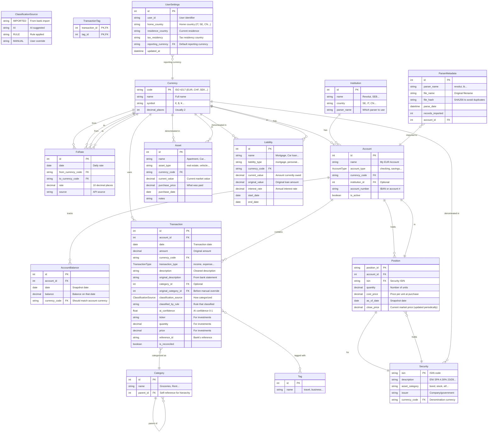

# Database Entity-Relationship Diagram

## Entity-Relationship Diagram (Mermaid)



## Key Design Decisions

### 1. Multi-Currency Support (Computed, Not Stored)
- Each **Transaction** stores original `amount` and `currency_code`
- Conversion to reporting currency is **computed on read** using FxRate table
- No stale stored values when rates change

### 2. Transaction Categorization
- **Category** supports hierarchy via `parent_id` (e.g., "Food" → "Groceries")
- **Tag** provides flexible many-to-many labeling
- Category is optional (AI can suggest later)
- `classification_source` tracks how category was assigned (imported/ai/rule/manual)

### 3. Investment Positions (Computed Values)
- `Position` stores: quantity, cost_price, close_price (updated periodically)
- Computed on read: cost_basis, market_value, unrealized_profit/loss
- **Transaction** has ticker, quantity, price for buy/sell transactions

### 4. Net Worth Calculation
- **AccountBalance** snapshots balances over time
- Total net worth = sum of (balance * fx_rate) + assets - liabilities
- All computed, nothing stored redundantly

### 5. Parser Metadata
- **ParserMetadata** tracks imports to avoid duplicate processing
- `file_hash` allows detecting if same file is re-uploaded

### 6. Design Philosophy: Store Facts, Compute Derivatives
- Store: amounts, prices, quantities, dates, descriptions
- Don't store: anything that can be derived from what you store
- This prevents data inconsistency and reduces storage
- Backend handles computation; database is for facts

## Normalization Notes

| Principle | How It's Applied |
|-----------|------------------|
| 1NF | Each field contains atomic values |
| 2NF | All non-PK fields depend on full PK in TransactionTag (composite PK) |
| 3NF | No transitive dependencies; Currency code is PK, not repeated |

## Indexes for Performance

- `FxRate.date` - Quick FX lookup by date
- `Transaction.account_id` + `Transaction.date` - Fast account history
- `AccountBalance.account_id` + `AccountBalance.date` - Balance history
- `Transaction.category_id` - Category filtering

## Classification Audit Trail

Track how each transaction got its category for smarter automation:

- **classification_source**: imported | ai | rule | manual
- **original_category_id**: remembers the category before manual override
- **classified_by_rule**: name of the rule that classified it (if any)
- **ai_confidence**: AI confidence score for potential future learning

This enables:

1. "Show me all transactions where I manually overrode AI"
2. "Learn from my manual categorizations to improve AI suggestions"
3. "Which rule classified this transaction incorrectly?"

## Critical Issues Found in Old Database

Comparing the old JSON database to the proposed SQL design reveals important issues:

### 1. Transaction Uses String References (VIOLATES IDs not names)

The old database stores:
```json
"from_account_id": "NB_CHECKING"
"to_account_id": "EXTERNAL_PAYEE"
"category": "uncategorized"
```

This is fragile. If you rename "uncategorized" to "unassigned", you break nothing. But if you have 10,000 transactions referencing "uncategorized" as a string, you now have data cleanup to do.

The new SQL design uses proper foreign keys: `category_id = 42` references a categories table row.

### 2. Investment Data is Denormalized

The old database has `instruments` and `positions` as separate arrays with redundant data:

```json
"instrument_id": "ISIN_IT0005521171",
"description": "ENI SPA 4.30% 23/28",
```

But `positions` re-declare this info and add calculated fields:

```json
"cost_price": 104.2594,
"cost_basis": 5212.97,
"close_price": 103.31,
"market_value": 5165.5,
"unrealized_profit": 0.0,
"unrealized_loss": 47.47
```

**Problem**: `cost_basis`, `market_value`, `unrealized_profit/loss` are derived/calculated values. These should NOT be stored—they should be computed on read.

**Correct design**:
- `Instrument` (or `Security`) table with ISIN, description, type
- `Position` table with just: account_id, instrument_id, quantity, cost_price (what you paid)
- Calculations: `market_value = quantity * current_price`, `unrealized = market_value - (quantity * cost_price)`

### 3. FX Rates are Monthly, Not Daily

Old database:
```json
{ "month": "2026-01", "from_currency": "SEK", "to_currency": "EUR", "rate": 10.68 }
```

This provides poor accuracy. A transaction on January 15 gets the same rate as one on January 31.

**Recommendation**: Daily rates in the new design. The old monthly data should be converted.

### 4. Missing: UserProfile Entity

The old database mixes user configuration with financial data:
```json
"user_profile": {
  "user_id": "example_user",
  "home_country": "IT",
  "tax_residency": "SE",
  "base_currency": "EUR"
}
```

**Recommendation**: Add a `UserSettings` table:
```sql
user_settings
    reporting_currency: FK to currencies.code
    home_country: string
    tax_residency: string
```

### 5. Missing: Security/Instrument Entity

The old `instruments` array has security info but no proper table.

**Recommendation**: Add a `Security` table:
```sql
Security {
    isin: string PK
    description: string
    asset_category: string  -- bond, stock, etf...
    issuer: string
}
```

### 6. HICP Data is External

The `hicp_series.json` (inflation data by country/month) doesn't belong in the core financial database. It's reference data for calculations.

**Recommendation**: Either:
- Keep as a separate reference table
- Fetch from external API when needed
- Store in a `ReferenceData` schema, not `Financial`

### 7. Balance References vs AccountBalance

Old database has `balance_references` as simple snapshots. This is correctly modeled in the new `AccountBalance` table but needs clarification:

**Question**: Do we need both `balance_references` (manual) and automatic balance tracking?

### 8. Rules Are String-Based Glob Matching

Old rules:
```json
{ "when": { "field": "description", "contains": "amazon" }, "set": { "category": "Shopping" } }
```

**Limitation**: Only supports "contains" matching.

**Recommendation**: The `classified_by_rule` field in Transaction can store the rule name that matched, but consider supporting more matching types:
- regex
- exact match
- prefix/suffix
- multi-field conditions (as already shown in .rules.example.json)

## Questions to Consider

1. Should `FxRate` have a composite unique constraint on (date, from_currency, to_currency)?
2. Do we need soft delete for Transactions (is_deleted flag)?
3. Should we track balance snapshots automatically or on-demand?
4. Do we need a Merchant entity separate from description?
5. Should calculated fields like `unrealized_profit` be stored or computed?
6. Do we need a separate Security/Instrument table, or is ticker+description sufficient?
