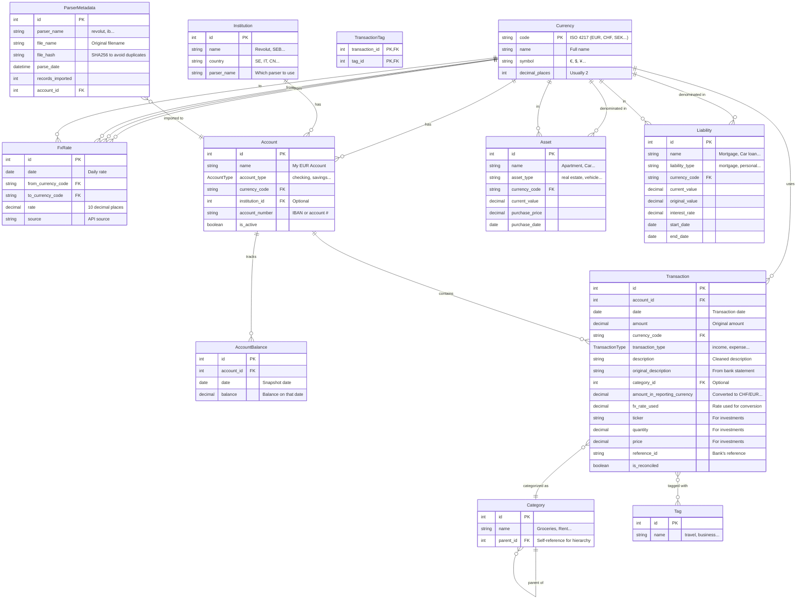

# Database Entity-Relationship Diagram

## Entity-Relationship Diagram (Mermaid)

## Key Design Decisions

### 1. Multi-Currency Support
- Each **Transaction** stores original `amount` and `currency_code`
- The `amount_in_reporting_currency` field stores the FX-converted value (e.g., to CHF)
- Daily **FxRate** table stores historical rates for accurate conversion

### 2. Transaction Categorization
- **Category** supports hierarchy via `parent_id` (e.g., "Food" → "Groceries")
- **Tag** provides flexible many-to-many labeling
- Category is optional (AI can suggest later)

### 3. Investment Tracking
- **Transaction** has `ticker`, `quantity`, `price` for securities
- **AccountType.INVESTMENT** distinguishes investment accounts

### 4. Net Worth Calculation
- **AccountBalance** snapshots balances over time for historical net worth
- **Asset** and **Liability** tables for real-world holdings

### 5. Parser Metadata
- **ParserMetadata** tracks imports to avoid duplicate processing
- `file_hash` allows detecting if same file is re-uploaded

## Normalization Notes

| Principle | How It's Applied |
|-----------|------------------|
| 1NF | Each field contains atomic values |
| 2NF | All non-PK fields depend on full PK in TransactionTag (composite PK) |
| 3NF | No transitive dependencies; Currency code is PK, not repeated |

## Indexes for Performance

- `FxRate.date` - Quick FX lookup by date
- `Transaction.account_id` + `Transaction.date` - Fast account history
- `AccountBalance.account_id` + `AccountBalance.date` - Balance history
- `Transaction.category_id` - Category filtering

## Questions to Consider

1. Should `FxRate` have a composite unique constraint on (date, from_currency, to_currency)?
2. Do we need soft delete for Transactions (is_deleted flag)?
3. Should we track balance snapshots automatically or on-demand?
